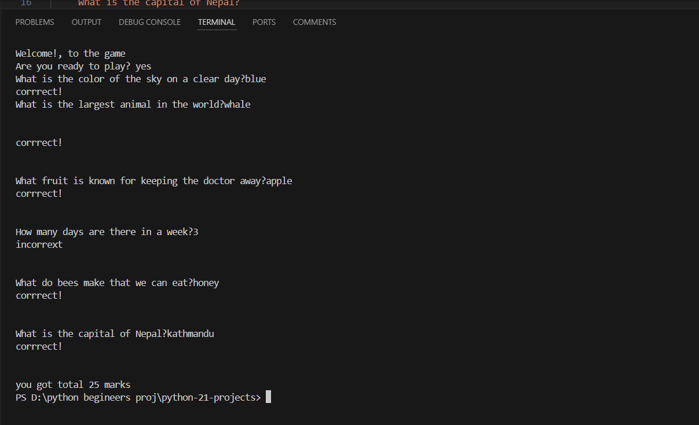

# python-21-projects

**Simple Quiz Game**

Project Description

This is a basic quiz game implemented in Python. The game presents a series of questions to the user, evaluates their answers, and calculates a total score based on their responses. Each correct answer increments the score by 5 points. At the end of the quiz, the total score is displayed.

**Features**

A list of pre-defined questions.
User input for answering questions.
Scoring system: 5 points for each correct answer.
Feedback for correct and incorrect answers.
Display of total score at the end of the quiz.

**How to Run the Project**

Ensure you have Python installed on your system. You can download it from python.org.
Download the quiz_game.py script from this repository.
Open your terminal or command prompt.
Navigate to the directory where quiz_game.py is located.
Run the script using the command: python quiz_game.py.
Sample Code
Here's a snippet of the Python code for the quiz game:
 

**Usage**

Run the script to start the quiz.
Answer each question when prompted.
Receive feedback on each answer.
At the end of the quiz, view your total score.
Contributing
If you'd like to contribute to this project, please fork the repository and submit a pull request. For major changes, please open an issue to discuss what you would like to change.

**License****

This project is open-source and available under the MIT License.
