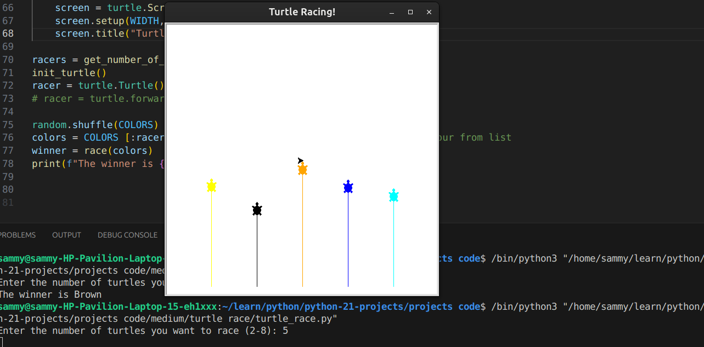

Turtle Racing Game

Overview

The Turtle Racing Game is a fun and interactive Python program that simulates a race between colorful turtles using the turtle graphics module. Users can choose the number of turtles to participate in the race, and each turtle moves forward a random distance at each step until one reaches the finish line. The first turtle to cross the finish line is declared the winner.
Features

    User Input: Allows users to choose the number of turtles participating in the race (between 2 and 8).
    Random Movement: Each turtle moves a random distance in each step, making the race unpredictable and exciting.
    Colorful Turtles: Turtles are randomly assigned one of the predefined colors for visual appeal.
    Graphical Interface: Uses the turtle module to create a graphical representation of the race.

Requirements

    Python 3.x
    Turtle module (usually included with Python)

How to Run

   1. Ensure you have Python installed on your system. If not, download and install it from python.org.
   2. Save the provided code into a Python file, e.g., turtle_race.py.
   3. Open a terminal or command prompt.
   4. Navigate to the directory where you saved the turtle_race.py file.
   5. Run the script by typing python turtle_race.py.

Code Explanation

Constants and Configuration

    COLORS: A list of colors used to assign to turtles.
    WIDTH and HEIGHT: Dimensions of the turtle race screen.

Functions

   1. get_number_of_racers(): Prompts the user to enter the number of turtles participating in the race and validates the input.
   2. race(colors): Manages the race, moving each turtle a random distance until one reaches the finish line.
   3. create_turtle(colors): Creates and positions the turtles at the starting line based on the number of racers.
    init_turtle(): Initializes the turtle screen with the specified width, height, and title.

Main Program Flow

   1. User Input: The program starts by asking the user to input the number of turtles for the race.
   2. Initialization: The turtle screen is initialized with the specified dimensions and title.
    3. Shuffle Colors: The list of colors is shuffled, and the required number of colors are selected based on the number of racers.
   4. Start Race: The race function is called, and turtles move forward randomly until one reaches the finish line.
   5. Declare Winner: The color of the winning turtle is printed.

   Snapshots

   

   Acknowledgements

This program utilizes the turtle module, which is a standard Python library for creating graphics and animations. Special thanks to the Python community for providing extensive documentation and tutorials.